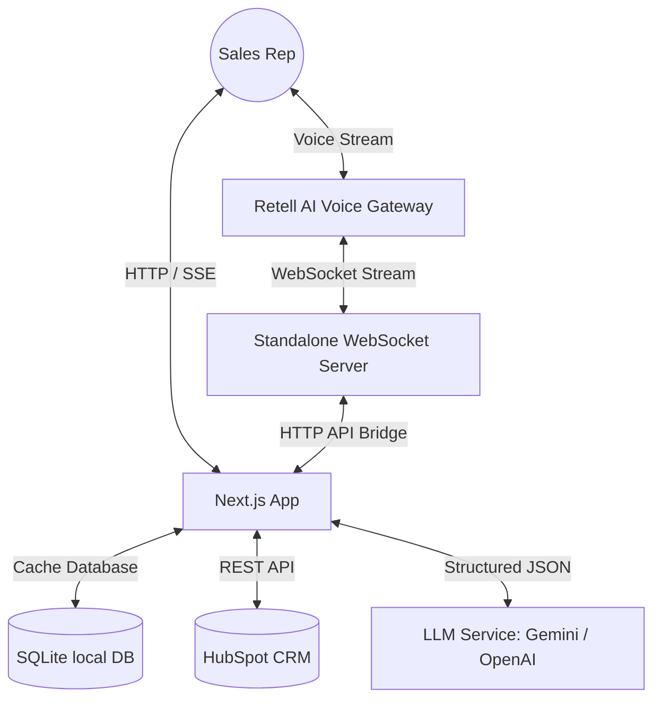

# Pipeline Pilot

Pipeline Pilot is an AI-powered sales standup and pipeline review focus room for sales teams. 

## 🚀 Core Feature Concept
* **Automated Calendar Standup:** Integrates with the sales rep's calendar to automatically insert a custom review focus room link into their daily morning standup event.
* **Pipeline Review Focus Room:** Reps click the link to enter this focus room. The voice AI (Alex) interacts with them, walking through prioritized deals and contacts in order of urgency.
* **CRM Action Write-Back:** Conversation decisions (such as deal stage moves, client notes, or flagging blockers) are queued in real-time. Reps review and sync them back to HubSpot CRM.
* **Manager Visibility:** Once the call terminates, an automated, AI-summarized review report containing rep sentiment, manager updates, and deal-level summaries is delivered to the manager.
* **Forecast Capability:** Can also be used for running pipeline forecast reviews.

---

## 🎯 Business Value & CRM Relevance
* **Engagement & Stickiness:** Replaces tedious CRM data entry with a simple 2-minute voice conversation, driving high software adoption.
* **Accountability:** Daily automated email updates sent directly to managers keep representatives accountable for pipeline status.
* **Product Differentiation:** Transitions the CRM from a passive system-of-record into a proactive, collaborative assistant.

### 📈 North Star Metric
1. **Standup Review Completion Rate (SRCR):** The percentage of scheduled review calls completed by reps each week.
2. **Frictionless CRM Admin Time Saved:** Calculated as 5 minutes per automated action synced back to HubSpot, showing direct ROI to sales operations.

---

## ⚙️ Technical Architecture
Pipeline Pilot is built to bridge remote deployments and serverless frontends with local SQLite persistent storage.



### Key Components:
1. **Next.js Client Dashboard:** Pipeline review room UI, setup flow modals, action queue ledgers, and email composability previews.
2. **Local SQLite Cache (`sales-voice-bot.db`):** Stores synced CRM contacts, deals, notes, LLM classifications, queued actions, and transcript logs.
3. **Standalone WebSocket Server (`ws-server.js`):** Interacts with Retell AI using the Custom LLM protocol. It bridges SQLite transactions via Next.js HTTP API endpoints (`/api/crm/*`) due to isolated container environments.
4. **LLM Engine (`llm.js`):** Classifies and prioritizes deals, streams voice answers, and parses post-call transcripts using **Gemini 2.5 Flash** or **GPT-4o**.

---

## 🛠️ Local Setup & Deployment

### 1. Configure Environments
Copy `.env.example` to `.env` and fill out your API credentials:
```sh
# HubSpot API Integration
HUBSPOT_ACCESS_TOKEN=your_hubspot_token

# LLM Providers (Gemini or OpenAI)
LLM_PROVIDER=gemini # or openai
GEMINI_API_KEY=your_gemini_key
OPENAI_API_KEY=your_openai_key

# Retell AI Credentials
RETELL_API_KEY=your_retell_key
RETELL_AGENT_ID=your_retell_agent_id
```

### 2. Install and Run
```sh
# Install dependencies
npm install

# Start development Next.js client & WebSockets server locally
npm run dev

# Or start standalone services separately:
npm run ws     # Runs standalone WS Server (Port 8080)
```

### 3. Local Seeding & Classifying
Run the onboarding steps on `http://localhost:3000`:
1. **Clear Previous Demo:** Archiving seeded demo data and wiping SQLite cache tables.
2. **Seed Demo Data:** Asking Gemini to write 4 realistic B2B deals directly to HubSpot.
3. **Sync HubSpot CRM:** Pulling deals, contacts, notes, and stages into the SQLite DB.
4. **Run AI Prioritization:** Letting Gemini score and prioritize deals (P5 Urgent to P1 Celebration).
5. **Start Daily Voice Review:** Reviewing deals with the AI assistant.

---

## ☁️ Production Deployment
Pipeline Pilot is designed to run on **Railway** container hosts or **Firebase App Hosting**:
* The startup process checks the environment variable `RAILWAY_SERVICE_NAME` to conditionally spawn the client-side Next.js server (`next start`) or the stand-alone websocket service (`node src/server/ws-server.js`).
