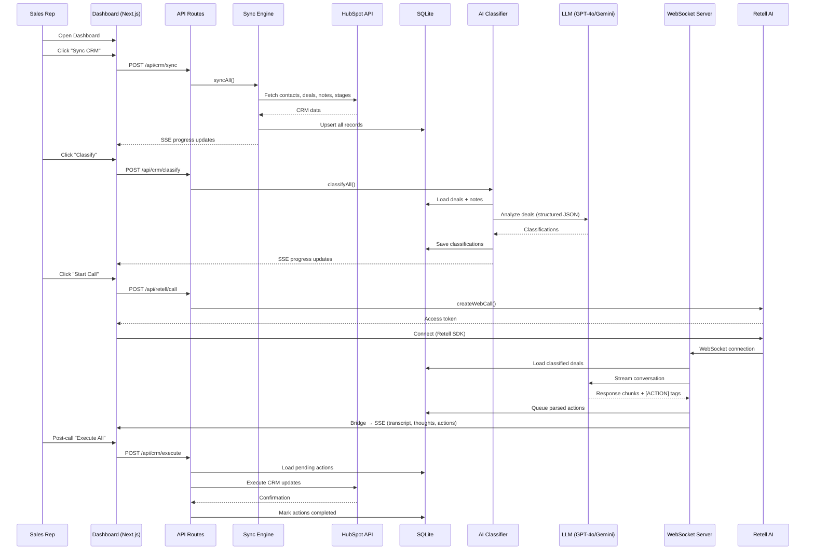

<](https://nextjs.org)
[](https://retellai.com)
[](https://hubspot.com)
[](https://openai.com)
[](https://deepmind.google/technologies/gemini/)
[](https://sqlite.org)
[](LICENSE)

</div>

---

## 📌 Table of Contents

- [Why Pipeline Pilot?](#-why-pipeline-pilot)
- [What It Does](#-what-it-does)
- [How It Works](#-how-it-works)
- [Technical Architecture](#-technical-architecture)
- [Project Structure](#-project-structure)
- [Getting Started](#-getting-started)
- [Environment Variables](#-environment-variables)
- [Deployment (Railway)](#-deployment-railway)
- [API Reference](#-api-reference)
- [Mock Mode](#-mock-mode)
- [Contributing](#-contributing)
- [License](#-license)

---

## 🤔 Why Pipeline Pilot?

Sales reps start every morning the same way: open the CRM, scroll through dozens of deals, mentally triage which ones matter, jot notes, and hope they didn't forget the contract that's been sitting unsigned for two weeks.

**Pipeline Pilot eliminates that entire ritual.**

Instead of forcing reps to _read_ their CRM, it lets them _talk_ to it. The system:

1. **Syncs** your HubSpot CRM data into a local database.
2. **Classifies** every deal using AI — assigning urgency, risk flags, and recommended actions.
3. **Calls you** (via Retell AI voice) for a 5-minute morning review, walking through the focus list conversationally.
4. **Queues CRM actions** (stage moves, notes, risk flags) that the rep confirms _by voice_ — then executes them all in one batch.

The result: **a morning routine that takes 5 minutes instead of 30**, with zero deals falling through the cracks.

---

## ✨ What It Does

| Feature | Description |
|---|---|
| **CRM Sync** | One-click full sync of HubSpot contacts, deals, notes, and pipeline stages into a local SQLite database |
| **AI Classification** | GPT-4o / Gemini classifies every deal into categories (URGENT, AT_RISK, CLOSE_READY, CELEBRATE, etc.) with priority scores 1–5 |
| **Voice Review** | Retell AI-powered voice call that walks through prioritized deals in a natural conversation |
| **Action Queuing** | AI suggests CRM actions during the call; rep confirms verbally; actions are queued and batch-executed |
| **Live Dashboard** | Real-time SSE-powered dashboard showing call transcript, AI thought process, queued actions, and deal cards |
| **Post-Call Review** | After the call, review all queued actions and execute them to HubSpot with one click |
| **Demo Seeding** | Built-in demo data generator that creates realistic contacts and deals in HubSpot for testing |
| **Multi-LLM Support** | Swap between OpenAI (GPT-4o) and Google Gemini (2.5 Flash) with a single env variable |
| **Graceful Degradation** | Full mock mode — runs without any API keys using built-in demo data and rule-based classification |

---

## ⚙️ How It Works

### The Daily Flow

```
┌─────────────────────────────────────────────────────────────────────┐
│                        REP'S MORNING ROUTINE                       │
├─────────────────────────────────────────────────────────────────────┤
│                                                                     │
│  1. Open Dashboard  ───►  2. Click "Sync CRM"                      │
│                                │                                    │
│                                ▼                                    │
│                     HubSpot ──► SQLite                              │
│                     (contacts, deals, notes, stages)                │
│                                │                                    │
│                                ▼                                    │
│  3. AI Classification  ───►  Focus List Generated                   │
│     (GPT-4o / Gemini)        (priority-ranked, categorized)         │
│                                │                                    │
│                                ▼                                    │
│  4. Click "Start Call"  ───►  Voice Review Begins                   │
│                                │                                    │
│     Alex (AI):  "Hey! How      │    ┌──────────────────────┐        │
│     did your day go?"          │    │  LIVE DASHBOARD      │        │
│                                │    │  • Transcript panel  │        │
│     Rep:  "Great, let's        │    │  • AI thoughts       │        │
│     review the pipeline"       │    │  • Action queue      │        │
│                                │    │  • Deal cards        │        │
│     Alex:  "TechCorp is        │    └──────────────────────┘        │
│     stale 12 days. Want        │                                    │
│     me to flag a risk?"        │                                    │
│                                │                                    │
│     Rep:  "Yes, flag it"       │                                    │
│                                │                                    │
│     [ACTION queued]  ──────────┼───► Dashboard shows action         │
│                                │                                    │
│  5. Call ends  ───►  Post-Call Review                               │
│                                │                                    │
│  6. "Execute All"  ───►  CRM updated in HubSpot                    │
│                                                                     │
└─────────────────────────────────────────────────────────────────────┘
```

### Voice ↔ Action Pipeline

During the voice call, the AI assistant embeds structured `[ACTION]...[/ACTION]` tags in its response stream. The WebSocket server parses these tags in real-time, extracts the JSON payload, and:

1. Stores the action in the `action_queue` SQLite table
2. Broadcasts an `action_queued` event via SSE to the dashboard
3. Strips the raw tags from the audio stream so the user hears natural speech

After the call, the rep reviews and executes actions — each one hits the HubSpot API to move stages, add notes, or flag risks.

---

## 🏗 Technical Architecture

### System Overview

```
┌──────────────────────────────────────────────────────────────────────────┐
│                          PIPELINE PILOT SYSTEM                          │
│                                                                          │
│  ┌────────────────┐     ┌─────────────────┐     ┌────────────────────┐  │
│  │   NEXT.JS APP  │     │  WS SERVER      │     │  RETELL AI CLOUD   │  │
│  │   (Port 3000)  │     │  (Port 8080)    │     │  (Voice Engine)    │  │
│  │                │     │                 │     │                    │  │
│  │  • Dashboard   │◄────│  • Custom LLM   │◄────│  • STT / TTS       │  │
│  │  • API Routes  │ SSE │    WebSocket    │ WS  │  • Voice Routing   │  │
│  │  • SSE Stream  │     │  • Action Parse │     │  • Call Management │  │
│  │                │     │  • Bridge Fwd   │     │                    │  │
│  └───────┬────────┘     └────────┬────────┘     └────────────────────┘  │
│          │                       │                                       │
│          │         ┌─────────────┴─────────────┐                        │
│          │         │                           │                        │
│          ▼         ▼                           ▼                        │
│  ┌────────────────────┐           ┌────────────────────┐                │
│  │    SQLite (Local)  │           │    LLM Provider    │                │
│  │                    │           │                    │                │
│  │  • contacts        │           │  OpenAI GPT-4o     │                │
│  │  • deals           │           │       OR           │                │
│  │  • notes           │           │  Google Gemini     │                │
│  │  • classifications │           │  2.5 Flash         │                │
│  │  • action_queue    │           │                    │                │
│  │  • transcripts     │           └────────────────────┘                │
│  └────────┬───────────┘                                                 │
│           │                                                              │
│           ▼                                                              │
│  ┌────────────────────┐                                                 │
│  │    HubSpot CRM     │                                                 │
│  │                    │                                                 │
│  │  • Contacts API    │                                                 │
│  │  • Deals API       │                                                 │
│  │  • Notes API       │                                                 │
│  │  • Pipelines API   │                                                 │
│  └────────────────────┘                                                 │
│                                                                          │
└──────────────────────────────────────────────────────────────────────────┘
```

### Dual-Process Architecture

Pipeline Pilot runs as **two processes**:

| Process | Port | Role |
|---|---|---|
| **Next.js App** | `3000` | Dashboard UI, API routes, SSE event stream |
| **WebSocket Server** | `8080` | Retell Custom LLM protocol, voice conversation logic, action parsing |

The two processes communicate via an internal **Bridge** — the WS server forwards events to Next.js via `POST /api/events/forward`, authenticated with a shared `BRIDGE_SECRET`. This enables the SSE stream powering the live dashboard.

### Core Modules

```
src/
├── app/                          # Next.js App Router
│   ├── api/
│   │   ├── crm/                  # CRM sync & action execution endpoints
│   │   ├── demo/                 # Demo data seeding & cleanup
│   │   ├── email/                # Post-call email summary
│   │   ├── events/               # SSE stream + bridge forwarding
│   │   ├── rep-config/           # Sales rep identity management
│   │   ├── retell/               # Call creation & agent setup
│   │   └── stream/               # SSE event subscription endpoint
│   ├── preview/                  # Preview/onboarding flow
│   ├── layout.js                 # Root layout (Plus Jakarta Sans + Inter)
│   ├── page.js                   # Entry point → Dashboard
│   └── globals.css               # Design system (CSS custom properties)
│
├── components/
│   ├── Dashboard.js              # Main orchestration component
│   ├── VoicePanel.js             # Call controls + Retell SDK integration
│   ├── TranscriptPanel.js        # Real-time conversation transcript
│   ├── CallPulsePanel.js         # AI thought stream + status indicators
│   ├── PostCallReview.js         # Action review & batch execution
│   ├── DealCard.js               # Individual deal classification card
│   ├── FocusList.js              # Prioritized deal list
│   ├── SetupView.js              # First-run configuration wizard
│   ├── SetupModal.js             # Setup modal overlay
│   ├── RepOnboarding.js          # Sales rep name onboarding
│   ├── StatusIndicator.js        # Connection status badges
│   └── ThoughtTicker.js          # Scrolling AI thought marquee
│
├── lib/
│   ├── database.js               # SQLite schema, CRUD, and queries
│   ├── hubspot.js                # HubSpot API client (with mock fallback)
│   ├── llm.js                    # Multi-provider LLM service (OpenAI + Gemini)
│   ├── classifier.js             # Deal classification orchestrator
│   ├── sync-engine.js            # CRM → SQLite sync pipeline
│   ├── action-executor.js        # Queued action → HubSpot execution
│   ├── retell.js                 # Retell agent & web call management
│   ├── demo-generator.js         # Realistic demo data factory
│   ├── email-templates.js        # HTML email templates for summaries
│   └── thought-emitter.js        # EventEmitter for cross-process events
│
└── server/
    └── ws-server.js              # Standalone WebSocket server for Retell
```

### Key Design Decisions

| Decision | Rationale |
|---|---|
| **SQLite (file-based)** | Both the Next.js API routes and the standalone WS server share the same `.db` file. No external database needed. Zero-config local dev. |
| **Dual-process (Next.js + Express WS)** | Retell requires a raw WebSocket endpoint for its Custom LLM protocol. Next.js doesn't natively support persistent WebSocket connections in API routes, so we run a separate Express server. |
| **Bridge pattern (WS → SSE)** | The WS server forwards events to Next.js via HTTP POST, which then broadcasts to all SSE subscribers. This decouples voice processing from UI updates. |
| **Action tag parsing** | The LLM is prompted to emit `[ACTION]{...}[/ACTION]` tags inline. The WS server buffers and parses these character-by-character during streaming, stripping them from the audio output while queueing the structured action. |
| **Mock-first design** | Every external service (HubSpot, OpenAI, Gemini, Retell) has a mock fallback. The entire app runs offline with `npm run dev` — no API keys required. |
| **Multi-LLM** | Auto-detects available API keys and switches between OpenAI and Gemini. Set `LLM_PROVIDER=gemini` or `LLM_PROVIDER=openai` to force a provider. |

### Data Flow



### Database Schema

| Table | Purpose |
|---|---|
| `contacts` | Synced HubSpot contacts (name, email, phone, company) |
| `deals` | Synced deals with stage, amount, days-in-stage |
| `notes` | Deal-associated CRM notes |
| `pipeline_stages` | HubSpot pipeline stage definitions |
| `classifications` | AI-generated priority, category, reasoning, recommended actions |
| `action_queue` | Voice-confirmed CRM actions (pending → executing → completed/failed) |
| `transcript_turns` | Full call transcript (speaker + content + timestamp) |
| `demo_records` | Tracks seeded demo records for cleanup |

---

## 📂 Project Structure

```
sales-voice-bot/
├── src/
│   ├── app/              # Next.js 14 App Router (pages + API)
│   ├── components/       # React components (Dashboard, Voice, etc.)
│   ├── lib/              # Core business logic modules
│   └── server/           # Standalone WebSocket server
├── scripts/
│   └── seed-demo-data.js # CLI script to seed demo data
├── public/               # Static assets
├── .env.example          # Environment variable template
├── package.json          # Dependencies & scripts
├── next.config.mjs       # Next.js configuration
└── README.md             # You are here
```

---

## 🚀 Getting Started

### Prerequisites

- **Node.js** ≥ 18.0.0
- **npm** (comes with Node.js)
- A **HubSpot** Private App token (optional — mock mode works without it)
- A **Retell AI** API key (optional — mock mode works without it)
- An **OpenAI** or **Google Gemini** API key (optional — mock mode works without it)

### Installation

```bash
# Clone the repository
git clone https://github.com/aadithya1996/sales-voice-bot.git
cd sales-voice-bot

# Install dependencies
npm install

# Copy environment template
cp .env.example .env

# Edit .env with your API keys (or leave defaults for mock mode)
```

### Running Locally

You need to start **two processes**:

```bash
# Terminal 1: Next.js Dashboard + API
npm run dev

# Terminal 2: WebSocket Server (for Retell voice)
npm run ws
```

Open [http://localhost:3000](http://localhost:3000) in your browser.

### Quick Start (Mock Mode)

No API keys? No problem. Pipeline Pilot runs fully in mock mode:

1. `npm install && npm run dev` (Terminal 1)
2. `npm run ws` (Terminal 2)
3. Open `http://localhost:3000`
4. Click **Sync CRM** → loads demo data
5. Click **Classify** → rule-based classification
6. Click **Start Call** → simulated voice conversation with mock responses

---

## 🔐 Environment Variables

| Variable | Required | Description |
|---|---|---|
| `HUBSPOT_ACCESS_TOKEN` | No* | HubSpot Private App token. Required scopes: `crm.objects.contacts.read/write`, `crm.objects.deals.read/write`, `crm.schemas.deals.read`, `crm.objects.owners.read` |
| `RETELL_API_KEY` | No* | Retell AI API key from [dashboard.retellai.com](https://dashboard.retellai.com) |
| `RETELL_AGENT_ID` | No | Auto-created on first run, or set manually |
| `OPENAI_API_KEY` | No* | OpenAI API key for GPT-4o classification and voice conversation |
| `GEMINI_API_KEY` | No* | Google Gemini API key (alternative to OpenAI) |
| `LLM_PROVIDER` | No | `openai` (default) or `gemini` — auto-detected from available keys |
| `PORT` | No | Next.js port (default: `3000`) |
| `WS_PORT` | No | WebSocket server port (default: `8080`) |
| `RETELL_WS_URL` | Yes** | Public WebSocket URL for Retell callback (e.g., `wss://your-domain/llm-websocket`) |
| `BRIDGE_SECRET` | Yes | Random secret for internal WS→Next.js event bridge authentication |
| `FIREBASE_PROJECT_ID` | No | Firebase project ID (for optional Firebase deployment) |

> \* All external services fall back to mock mode when keys are absent.
>
> \*\* Required only for live Retell voice calls (not needed in mock mode).

---

## 🚄 Deployment (Railway)

Pipeline Pilot requires **two Railway services** (dual-process architecture):

### Service 1: Next.js App

| Setting | Value |
|---|---|
| **Start Command** | `npm run build && npm start` |
| **Port** | `3000` |

### Service 2: WebSocket Server

| Setting | Value |
|---|---|
| **Start Command** | `npm run ws` |
| **Port** | `8080` |

### Steps

1. Push to GitHub
2. Create a new Railway project
3. Add **Service 1** (Next.js) — connect to your GitHub repo
4. Add **Service 2** (WebSocket) — same repo, different start command
5. Set environment variables on both services
6. Set `RETELL_WS_URL` to: `wss://<ws-service-domain>/llm-websocket`
7. Set `NEXTJS_URL` on the WS service to the Next.js service's public URL
8. Deploy 🚀

---

## 📡 API Reference

### CRM Operations

| Method | Endpoint | Description |
|---|---|---|
| `POST` | `/api/crm/sync` | Sync HubSpot → SQLite |
| `POST` | `/api/crm/classify` | Run AI classification on synced deals |
| `GET` | `/api/crm/deals` | Get classified deal focus list |
| `POST` | `/api/crm/execute` | Execute all pending queued actions |

### Voice / Retell

| Method | Endpoint | Description |
|---|---|---|
| `POST` | `/api/retell/call` | Create a new Retell web call |
| `POST` | `/api/retell/setup` | Create/update the Retell agent |

### Events

| Method | Endpoint | Description |
|---|---|---|
| `GET` | `/api/stream` | SSE event stream for live dashboard updates |
| `POST` | `/api/events/forward` | Internal bridge endpoint (WS → Next.js) |

### Demo

| Method | Endpoint | Description |
|---|---|---|
| `POST` | `/api/demo/seed` | Seed demo contacts & deals into HubSpot |
| `POST` | `/api/demo/cleanup` | Remove seeded demo records |

---

## 🧪 Mock Mode

Pipeline Pilot is designed to run without any API keys for local development and demos:

- **HubSpot**: Returns 4 realistic mock contacts and deals with pre-written notes
- **OpenAI/Gemini**: Uses a rule-based classifier (priority heuristics based on stage + days stale)
- **Retell**: Returns mock access tokens; voice panel simulates conversation flow
- **LLM Streaming**: Word-by-word mock responses with embedded `[ACTION]` tags

Mock mode activates automatically when API keys are missing or set to placeholder values.

---

## 🤝 Contributing

1. Fork the repository
2. Create a feature branch (`git checkout -b feature/amazing-feature`)
3. Commit your changes (`git commit -m 'Add amazing feature'`)
4. Push to the branch (`git push origin feature/amazing-feature`)
5. Open a Pull Request

---

## 📄 License

This project is licensed under the MIT License — see the [LICENSE](LICENSE) file for details.

---

<div align="center">

**Built with ❤️ by [Aadithya](https://github.com/aadithya1996)**

_Pipeline Pilot — Because your CRM should talk to you, not the other way around._

</div>
]]>
